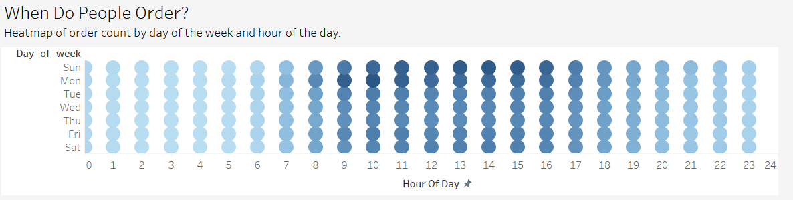
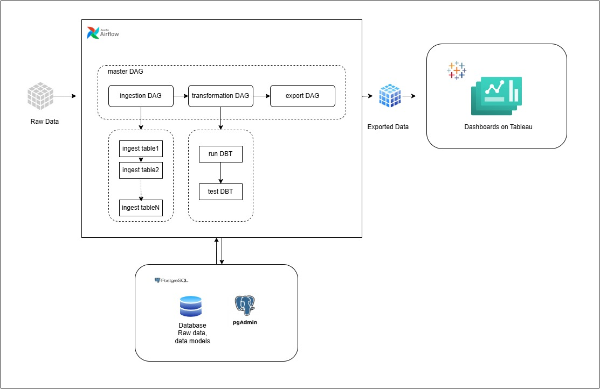

# 🛒 Instacart Market Basket Analysis - Cartflow

## 📌 Motivation

As a data engineer passionate about transforming raw data into actionable insights, I wanted to explore how modern tools like **Apache Airflow**, **DBT**, and **PostgreSQL** can work together in a real-world data pipeline. The Instacart dataset, with its rich customer-order-product structure, presented the perfect playground to simulate real-world data workflows and produce meaningful business intelligence.

This project was designed to:

* Practice building production-ready **data pipelines** using **Airflow orchestration**
* Apply **DBT modeling** best practices (staging and transformation)
* Design insightful **dashboards** using **Tableau** to showcase business value

---

## 🏗️ Project Overview

**Dataset:** [Instacart Market Basket Analysis on Kaggle](https://www.kaggle.com/c/instacart-market-basket-analysis)

**Tech Stack:**

* **Apache Airflow** – Pipeline orchestration
* **PostgreSQL** – Data warehouse
* **DBT** – Data modeling and transformations
* **Python (Pandas + SQLAlchemy)** – Data ingestion/export
* **Tableau Public** – Dashboarding

### 🔄 End-to-End Workflow

```
CSV Data → Ingest via Airflow → Store in PostgreSQL → Transform with DBT → Export to CSV → Visualize in Tableau
```

---

## 📊 Dashboard: Instacart User Behavior & Reorder Trends

Explore the **live dashboard on Tableau Public**: [👉 View Dashboard](https://www.kaggle.com/datasets/yasserh/instacart-online-grocery-basket-analysis-dataset)

### 📌 Key Insights:

1. **User Order Volume** – How many orders do users typically place?
2. **Order Frequency** – Distribution of average days between orders
3. **When Do People Order?** – Heatmap of hour-of-day vs day-of-week



> Users predominantly shop in the late mornings on weekends, suggesting marketing pushes during this time may be most effective.

4. **Reorder Behavior** – What proportion of a user’s basket is typically reordered?

> This dashboard answers critical questions about user retention, reorder habits, and peak shopping times.

---

## 🔧 Pipeline Architecture



> This diagram illustrates the three primary DAGs:
>
> 1. **Data Ingestion DAG:** Loads CSVs into PostgreSQL
> 2. **DBT DAG:** Runs staging models and builds final marts
> 3. **Export DAG:** Extracts transformed tables into CSVs for analytics use

Each DAG is triggered sequentially using Airflow’s `TriggerDagRunOperator`, ensuring smooth orchestration from raw data to dashboard-ready output.

---

## 📁 Project Structure

```
cartflow/
├── airflow/
│   ├── dags/
│   │   ├── crtfl_ingest.py
│   │   └── crtfl_transform.py
│   │   └── crtfl_export.py
│   │   └── crtfl_master.py
├── dbt/
│   ├── models/
│   │   ├── staging/
│   │   └── marts/
├── data_exports/
│   └── *.csv
├── images/
│   └── cartflow_arhictetcure.jpg
└── README.md
```

---

## 🚀 Future Improvements

* Add more KPIs to dashboards (AOV, top aisles/departments)
* Automate dashboard refresh using Tableau Webhooks or API
* Deploy using Docker + dbt Cloud/Airflow Cloud

---

## 👤 Author

**Tanmay Parulekar**  
[LinkedIn](https://www.linkedin.com/in/tanmay-parulekar) • [GitHub](https://github.com/tanmaymp)

---

> ⭐ If you found this project insightful, feel free to give it a star!
